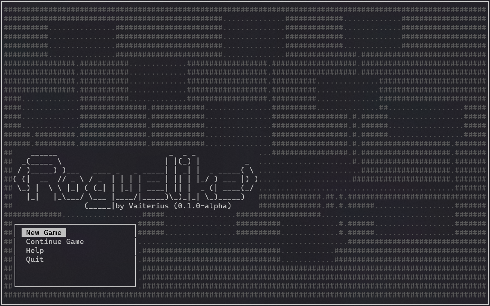
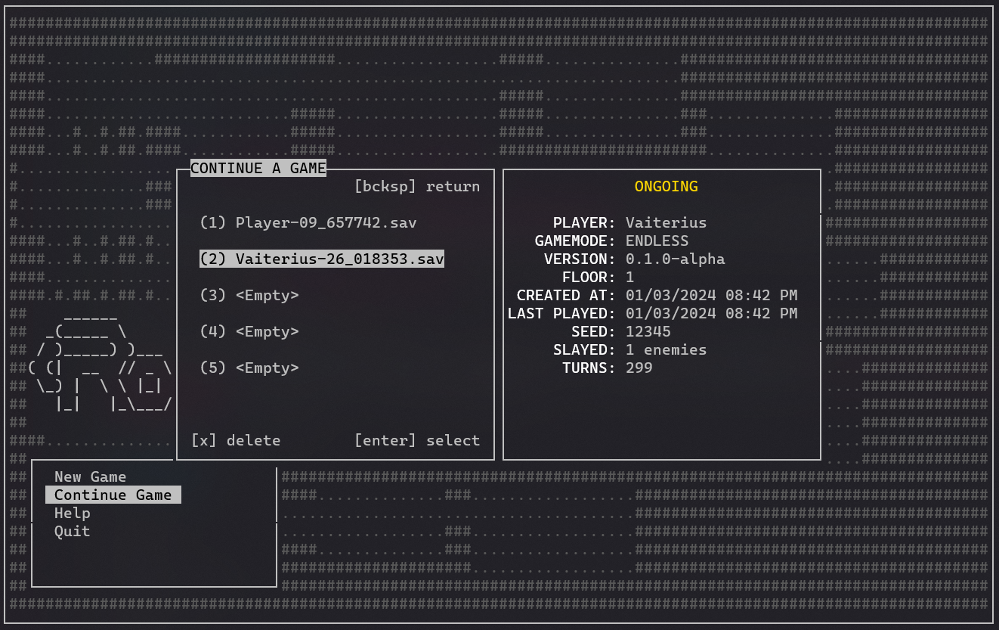
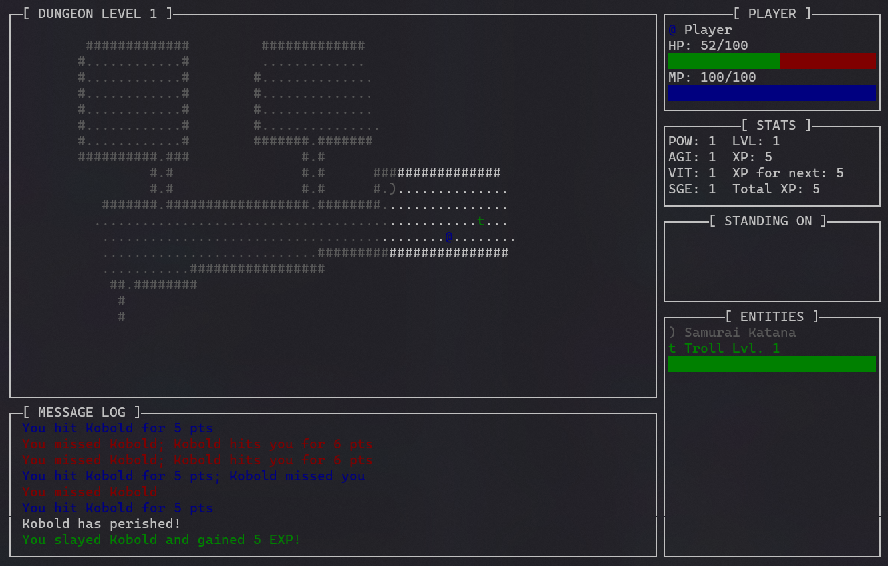
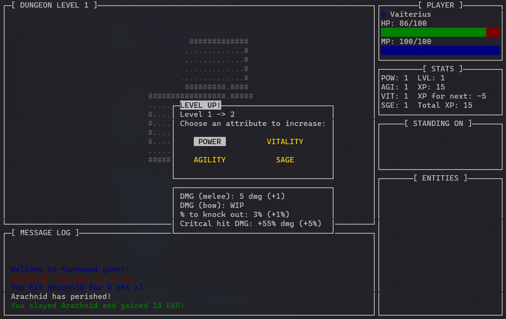

# Unnamed Roguelike

### 🚧 Under Development! (beta) 🚧

A retro traditional roguelike developed completely within the Python Standard Library and played on the terminal. Uses the curses library for terminal input/output handling. Fully ASCII interface and keyboard-controlled. Players can save their progress mid-game, but death is permanent – there's no undoing it.

## Description

Equip yourself with diverse armor, face creatures head-on with formidable weapons, and unleash magical abilities as you descend into the monster-filled dungeon down a series of ever-more treacherous floors. Will you prove your mettle and conquer the hallowing depths, or will **darkness** claim you?

**Normal mode**: An ancient relic on the 27th floor needs to be retrieved. Locate all 3 scattered glyphs within the dungeon to unlock the passage leading to the final room. Winning the game requires the relic (and yourself) to be safely taken back up to the entrance.  

**Endless mode**: There is no need to activate or fetch anything. You are cursed to fight until your inevitable death!

### Development screenshots

    
    

    
    

## Run Me!

I will upload this game to [itch.io](https://vaiterius.itch.io/) as soon as it's finished. Every commit to this repo should be a working state of the game so you can run it anytime during its development process. Clone the repo into your machine and run the `main.py` file in the root directory.

Must have [Python](https://www.python.org/) 3.10+ installed.

### Available platforms

**Linux** - Should work natively.  
**Mac** - Should work natively.  
**OpenBSD** - Should work natively.  
**Windows** - Might not work natively, only the Linux distributions of Python has the curses module required to play the game as far as I know. You might need to install the module seperately [here](https://pypi.org/project/windows-curses/), preferrably in a virtual environment.  

## Controls

### Movement
| Direction    | Arrow Keys   | Numpad Keys     | Vi Keys      |
|--------------|--------------|-----------------|--------------|
| Up           | <kbd>↑</kbd> | <kbd>↑</kbd>    | <kbd>k</kbd> |
| Down         | <kbd>↓</kbd> | <kbd>↓</kbd>    | <kbd>j</kbd> |
| Left         | <kbd>←</kbd> | <kbd>←</kbd>    | <kbd>h</kbd> |
| Right        | <kbd>→</kbd> | <kbd>→</kbd>    | <kbd>l</kbd> |
| Upper-left   |              | <kbd>Home</kbd> | <kbd>y</kbd> |
| Upper-right  |              | <kbd>PgUp</kbd> | <kbd>u</kbd> |
| Bottom-left  |              | <kbd>End</kbd>  | <kbd>b</kbd> |
| Bottom-right |              | <kbd>PgDn</kbd> | <kbd>n</kbd> |

*Note that the player can move diagonally but this is not supported with arrow keys*

### Actions

#### General

**Save and close game** - <kbd>Shift</kbd> + <kbd>q</kbd>  
**Save and go back to main menu** - <kbd>m</kbd>  
**Confirm action** - <kbd>Enter</kbd>  
**Go back to previous state/menu** - <kbd>Backspace</kbd>

#### In-Game

**Open inventory** - <kbd>Tab</kbd> or <kbd>i</kbd>  
**Pick up an item** - <kbd>p</kbd>  
**Drop an item from inventory** - <kbd>d</kbd>  
**Shoot arrow/staff projectile** - <kbd>Enter</kbd>  
**Select target** - See [movement](#movement) controls  
**Activate relic** - <kbd>Shift</kbd> + <kbd>Enter</kbd>  
**Descend stairs** - <kbd>></kbd>  
**Ascend stairs** - <kbd><</kbd>  
**Wait a turn** - <kbd>.</kbd> or <kbd>Del</kbd>

## Contributions
The game will be open to community feedback soon for any questions, feedback, bug reports, etc.

Stay tuned!